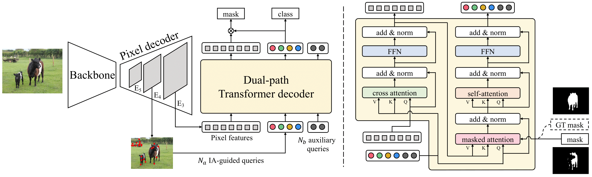
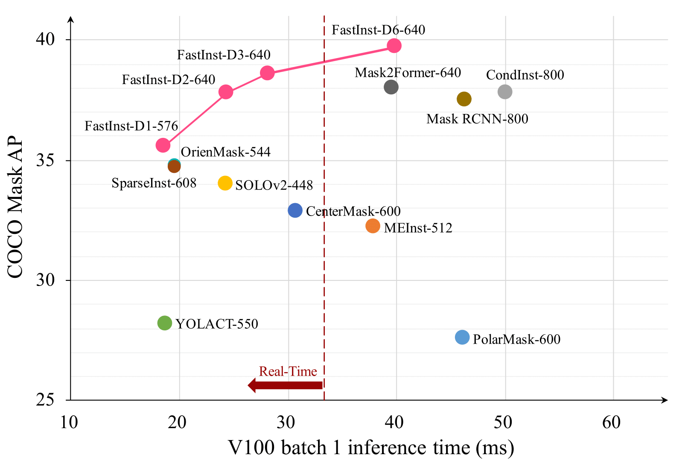

# FastInst: A Simple Query-Based Model for Real-Time Instance Segmentation

[[`arXiv`](https://arxiv.org/abs/2303.08594)] [[`BibTeX`](#CitingFastInst)]

<p align="center"></p>

### Features

* A simple query-based model for fast instance segmentation.
* **State-of-the-art** real-time performance under the same setting.
* Support major segmentation datasets: COCO, Cityscapes, ADE20K.

***

## Updates

* [2023/6] FastInst has been integrated into [ModelScope](https://www.modelscope.cn/home). Try out the Online Demo at [FastInst](https://modelscope.cn/models/damo/cv_resnet50_fast-instance-segmentation_coco/summary) 🚀.
* [2023/4] We have released the code and checkpoints for FastInst. Welcome to your attention!

## Installation

See [installation instructions](INSTALL.md).

## Getting Started

See [Results](#results).

See [Preparing Datasets for FastInst](datasets/README.md).

See [Getting Started](#getting-started-1).

***

# Results

<p></p>

### COCO Instance Segmentation

<table><tbody>
<!-- START TABLE -->
<!-- TABLE HEADER -->
<th valign="bottom">Name</th>
<th valign="bottom">Backbone</th>
<th valign="bottom">Epochs</th>
<th valign="bottom">Input</th>
<th valign="bottom">AP<sup>val</sup></th>
<th valign="bottom">AP</th>
<th valign="bottom">Params</th>
<th valign="bottom">GFlops</th>
<th valign="bottom">FPS (V100)</th>
<th valign="bottom">download</th>

<tr>
<td align="left"><a href="configs/coco/instance-segmentation/fastinst_R50_ppm-fpn_x1_576.yaml">FastInst-D1</a></td>
<td align="center">R50</td>
<td align="center">50</td>
<td align="center">576</td>
<td align="center">34.9</td>
<td align="center">35.6</td>
<td align="center">30M</td>
<td align="center">49.6</td>
<td align="center">53.8</td>
<td align="center"><a href="https://github.com/junjiehe96/FastInst/releases/download/v0.1.0/fastinst_R50_ppm-fpn_x1_576_34.9.pth">model</a></td>
</tr>

<tr>
<td align="left"><a href="configs/coco/instance-segmentation/fastinst_R50_ppm-fpn_x3_640.yaml">FastInst-D3</a></td>
<td align="center">R50</td>
<td align="center">50</td>
<td align="center">640</td>
<td align="center">37.9</td>
<td align="center">38.6</td>
<td align="center">34M</td>
<td align="center">75.5</td>
<td align="center">35.5</td>
<td align="center"><a href="https://github.com/junjiehe96/FastInst/releases/download/v0.1.0/fastinst_R50_ppm-fpn_x3_640_37.9.pth">model</a></td>
</tr>

<tr>
<td align="left"><a href="configs/coco/instance-segmentation/fastinst_R101_ppm-fpn_x3_640.yaml">FastInst-D3</a></td>
<td align="center"><a href="https://dl.fbaipublicfiles.com/detectron2/ImageNetPretrained/MSRA/R-101.pkl">R101</a></td>
<td align="center">50</td>
<td align="center">640</td>
<td align="center">38.9</td>
<td align="center">39.9</td>
<td align="center">53M</td>
<td align="center">112.9</td>
<td align="center">28.0</td>
<td align="center"><a href="https://github.com/junjiehe96/FastInst/releases/download/v0.1.0/fastinst_R101_ppm-fpn_x3_640_38.9.pth">model</a></td>
</tr>

<tr>
<td align="left"><a href="configs/coco/instance-segmentation/fastinst_R50-vd-dcn_ppm-fpn_x1_576.yaml">FastInst-D1</a></td>
<td align="center"><a href="https://github.com/rwightman/pytorch-image-models/releases/download/v0.1-weights/resnet50d_ra2-464e36ba.pth">R50-d-DCN</a></td>
<td align="center">50</td>
<td align="center">576</td>
<td align="center">37.4</td>
<td align="center">38.0</td>
<td align="center">30M</td>
<td align="center"> - </td>
<td align="center">47.8</td>
<td align="center"><a href="https://github.com/junjiehe96/FastInst/releases/download/v0.1.0/fastinst_R50-vd-dcn_ppm-fpn_x1_576_37.4.pth">model</a></td>
</tr>

<tr>
<td align="left"><a href="configs/coco/instance-segmentation/fastinst_R50-vd-dcn_ppm-fpn_x3_640.yaml">FastInst-D3</a></td>
<td align="center"><a href="https://github.com/rwightman/pytorch-image-models/releases/download/v0.1-weights/resnet50d_ra2-464e36ba.pth">R50-d-DCN</a></td>
<td align="center">50</td>
<td align="center">640</td>
<td align="center">40.1</td>
<td align="center">40.5</td>
<td align="center">35M</td>
<td align="center"> - </td>
<td align="center">32.5</td>
<td align="center"><a href="https://github.com/junjiehe96/FastInst/releases/download/v0.1.0/fastinst_R50-vd-dcn_ppm-fpn_x3_640_40.1.pth">model</a></td>
</tr>

</tbody></table>

# Getting Started

This document provides a brief intro of the usage of FastInst.

Please
see [Getting Started with Detectron2](https://github.com/facebookresearch/detectron2/blob/master/GETTING_STARTED.md) for
full usage.

#### Evaluate our pretrained models

* You can download our pretrained models and evaluate them with the following commands.
  ```sh
  python train_net.py --eval-only --num-gpus 4 --config-file config_path MODEL.WEIGHTS /path/to/checkpoint_file
  ```
  for example, to evaluate our released the fastest model, you can copy the config path from the table, download the
  pretrained checkpoint into `/path/to/checkpoint_file`, and run
  ```sh
  python train_net.py --eval-only --num-gpus 4 --config-file configs/coco/instance-segmentation/fastinst_R50_ppm-fpn_x1_576.yaml MODEL.WEIGHTS /path/to/checkpoint_file
  ```
  which can reproduce the model.

#### Train FastInst to reproduce results

* Use the above command without `eval-only` will train the model.
  ```sh
  python train_net.py --num-gpus 4 --config-file config_path
  ```
* For `R101` backbone, you need to
  download and specify the path of the pretrained backbones
  with `MODEL.WEIGHTS /path/to/pretrained_checkpoint`. The download link can be found in the above [table](#results).
  ```sh
  python train_net.py --num-gpus 4 --config-file config_path MODEL.WEIGHTS /path/to/pretrained_checkpoint
  ```
* For `R50-d-DCN` backbone, you need to download and convert the pretrained backbones, and specify the path.
  ```sh
  python tools/convert-timm-to-d2.py /path/to/resnet50d_ra2-464e36ba.pth /path/to/resnet50d_ra2-464e36ba.pkl
  python train_net.py --num-gpus 4 --config-file config_path MODEL.WEIGHTS /path/to/resnet50d_ra2-464e36ba.pkl
  ```

## LICNESE

FastInst is released under the [MIT Licence](LICENSE).

## <a name="CitingFastInst"></a>Citing FastInst

If you find FastInst is useful in your research or applications, please consider giving us a star &#127775; and citing
FastInst by the following BibTeX entry.

```BibTeX
@article{he2023fastinst,
  title={FastInst: A Simple Query-Based Model for Real-Time Instance Segmentation},
  author={He, Junjie and Li, Pengyu and Geng, Yifeng and Xie, Xuansong},
  journal={arXiv preprint arXiv:2303.08594},
  year={2023}
}
```

## Acknowledgement

Sincerely thanks to these excellent opensource projects

* [DETR](https://github.com/facebookresearch/detr)
* [Mask2Former](https://github.com/facebookresearch/Mask2Former)
